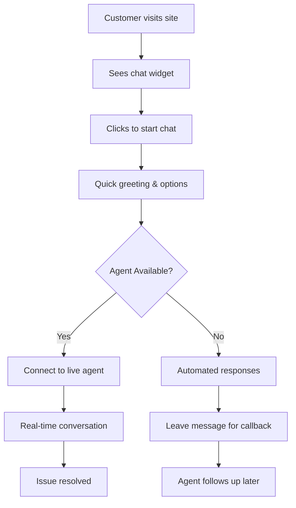

# COMPHILITY Chat System Implementation Plan

## 🎯 **Overview**
A comprehensive real-time chat system for customer support, product inquiries, and order assistance to enhance customer experience and reduce support tickets.

---

## 🔍 **Business Requirements**

### **Customer Needs**
- ❓ **Product Inquiries** - Ask about specifications, compatibility, availability
- 🛒 **Order Support** - Track orders, modify shipping, payment issues  
- 🔧 **Technical Help** - PC building advice, installation support
- 💬 **General Support** - Returns, warranty, account issues
- 🕒 **24/7 Availability** - Automated responses when agents offline

### **Business Benefits**
- 📈 **Increased Sales** - Instant product guidance leads to purchases
- 😊 **Customer Satisfaction** - Immediate support reduces frustration
- ⚡ **Reduced Response Time** - Real-time vs email/phone delays
- 💰 **Cost Efficiency** - One agent handles multiple chats
- 📊 **Better Insights** - Chat analytics reveal customer pain points

---

## 🏗️ **System Architecture**

### **Frontend Components**
```
Chat System/
├── Customer Interface/
│   ├── ChatWidget.vue           # Floating chat button/window
│   ├── ChatWindow.vue           # Main chat interface
│   ├── MessageBubble.vue        # Individual message display
│   ├── ChatInput.vue            # Message input with attachments
│   ├── TypingIndicator.vue      # Show when agent is typing
│   ├── ChatHistory.vue          # Previous conversation history
│   └── QuickActions.vue         # Pre-defined quick responses
│
├── Admin Interface/
│   ├── ChatDashboard.vue        # Agent chat management
│   ├── ActiveChats.vue          # List of ongoing conversations
│   ├── ChatDetails.vue          # Individual chat conversation
│   ├── CustomerInfo.vue         # Customer profile sidebar
│   ├── CannedResponses.vue      # Pre-written responses
│   ├── ChatAnalytics.vue        # Chat statistics and reports
│   └── AgentStatus.vue          # Online/offline status
│
└── Shared Components/
    ├── EmojiPicker.vue          # Emoji selection
    ├── FileUpload.vue           # Image/file attachments
    ├── MessageSearch.vue        # Search chat history
    └── ChatNotifications.vue    # Push notifications
```

### **Backend Services**
```
Chat Services/
├── WebSocket Server            # Real-time messaging
├── Message Storage            # Chat history database
├── File Upload Handler        # Image/document sharing
├── Push Notification Service  # Browser/mobile notifications
├── Auto-Response System       # AI/chatbot responses
├── Chat Analytics Service     # Usage statistics
└── Integration APIs           # Connect with orders/products
```

---

## 🎨 **User Experience Design**

### **Customer Chat Flow**


### **Chat Widget States**
1. **Minimized** - Small floating button with notification badge
2. **Expanded** - Full chat window with conversation
3. **Notification** - New message indicator with sound/vibration
4. **Offline** - Contact form when no agents available

---

## 💻 **Technical Implementation**

### **Real-Time Communication**
```javascript
// WebSocket connection for real-time messaging
class ChatService {
  constructor() {
    this.socket = null
    this.reconnectAttempts = 0
    this.maxReconnectAttempts = 5
  }
  
  connect() {
    this.socket = new WebSocket('wss://api.comphility.com/chat')
    this.setupEventHandlers()
  }
  
  sendMessage(message) {
    if (this.socket.readyState === WebSocket.OPEN) {
      this.socket.send(JSON.stringify({
        type: 'message',
        content: message.content,
        chatId: message.chatId,
        userId: message.userId,
        timestamp: new Date().toISOString()
      }))
    }
  }
  
  setupEventHandlers() {
    this.socket.onmessage = (event) => {
      const data = JSON.parse(event.data)
      this.handleIncomingMessage(data)
    }
    
    this.socket.onclose = () => {
      this.attemptReconnection()
    }
  }
}
```

### **Message Data Structure**
```javascript
const message = {
  id: 'uuid',
  chatId: 'chat-session-id',
  senderId: 'user-or-agent-id',
  senderType: 'customer|agent|system',
  content: 'message text',
  messageType: 'text|image|file|system',
  timestamp: '2025-01-01T12:00:00Z',
  status: 'sent|delivered|read',
  attachments: [
    {
      type: 'image|file',
      url: 'file-url',
      name: 'filename.jpg',
      size: 1024
    }
  ],
  metadata: {
    customerInfo: {},
    orderId: null,
    productId: null
  }
}
```

---

## 🔧 **Feature Implementation**

### **Phase 1: Core Chat System**

#### **Customer Chat Widget**
```vue
<!-- ChatWidget.vue -->
<template>
  <div class="chat-widget" :class="{ 'expanded': isExpanded }">
    <!-- Minimized State -->
    <div v-if="!isExpanded" class="chat-button" @click="expandChat">
      <i class="fas fa-comments"></i>
      <div v-if="unreadCount > 0" class="notification-badge">
        {{ unreadCount }}
      </div>
    </div>
    
    <!-- Expanded Chat Window -->
    <div v-else class="chat-window">
      <div class="chat-header">
        <div class="agent-info">
          <div class="agent-avatar">
            <i class="fas fa-headset"></i>
          </div>
          <div class="agent-details">
            <h4>COMPHILITY Support</h4>
            <span class="status online">Online</span>
          </div>
        </div>
        <button @click="minimizeChat" class="minimize-btn">
          <i class="fas fa-minus"></i>
        </button>
      </div>
      
      <div class="chat-messages" ref="messagesContainer">
        <MessageBubble 
          v-for="message in messages" 
          :key="message.id"
          :message="message"
          :is-own="message.senderId === currentUser?.id"
        />
        <TypingIndicator v-if="agentTyping" />
      </div>
      
      <ChatInput 
        @send-message="handleSendMessage"
        @typing="handleTyping"
        :disabled="!isConnected"
      />
    </div>
  </div>
</template>
```

#### **Message Bubble Component**
```vue
<!-- MessageBubble.vue -->
<template>
  <div class="message-bubble" :class="messageClasses">
    <div class="message-content">
      <div v-if="message.messageType === 'text'" class="text-message">
        {{ message.content }}
      </div>
      
      <div v-else-if="message.messageType === 'image'" class="image-message">
        
        <p v-if="message.content">{{ message.content }}</p>
      </div>
      
      <div v-else-if="message.messageType === 'system'" class="system-message">
        <i class="fas fa-info-circle"></i>
        {{ message.content }}
      </div>
    </div>
    
    <div class="message-meta">
      <span class="timestamp">{{ formatTime(message.timestamp) }}</span>
      <i v-if="isOwn && message.status === 'read'" class="fas fa-check-double read"></i>
      <i v-else-if="isOwn && message.status === 'delivered'" class="fas fa-check delivered"></i>
    </div>
  </div>
</template>
```

### **Phase 2: Admin Dashboard**

#### **Agent Chat Dashboard**
```vue
<!-- ChatDashboard.vue -->
<template>
  <div class="chat-dashboard">
    <div class="dashboard-sidebar">
      <AgentStatus />
      <ActiveChats 
        :chats="activeChats"
        @select-chat="selectChat"
        :selected-chat="selectedChatId"
      />
      <CannedResponses @use-response="insertCannedResponse" />
    </div>
    
    <div class="chat-main">
      <div v-if="selectedChat" class="chat-conversation">
        <div class="chat-header">
          <CustomerInfo :customer="selectedChat.customer" />
          <div class="chat-actions">
            <button @click="transferChat" class="btn-transfer">
              <i class="fas fa-exchange-alt"></i>
              Transfer
            </button>
            <button @click="closeChat" class="btn-close">
              <i class="fas fa-times"></i>
              Close
            </button>
          </div>
        </div>
        
        <ChatMessages 
          :messages="selectedChat.messages"
          :typing-users="typingUsers"
        />
        
        <ChatInput 
          @send-message="handleAgentMessage"
          @typing="handleAgentTyping"
          :placeholder="'Type your response...'"
        />
      </div>
      
      <div v-else class="no-chat-selected">
        <i class="fas fa-comments"></i>
        <p>Select a chat to start helping customers</p>
      </div>
    </div>
  </div>
</template>
```

### **Phase 3: Advanced Features**

#### **Automated Responses**
```javascript
// Auto-response system for common queries
const autoResponses = {
  greeting: {
    trigger: ['hello', 'hi', 'hey', 'good morning'],
    response: `Hi there! 👋 Welcome to COMPHILITY! 
    
How can I help you today?
• Ask about products
• Track your order  
• Get technical support
• General inquiries`
  },
  
  orderTracking: {
    trigger: ['track order', 'order status', 'where is my order'],
    response: 'I can help you track your order! Please provide your order number (starts with ORD-)',
    requiresInput: true,
    nextAction: 'processOrderLookup'
  },
  
  productInquiry: {
    trigger: ['product', 'price', 'availability', 'in stock'],
    response: 'I\'d be happy to help with product information! Could you tell me which product you\'re interested in?',
    requiresInput: true,
    nextAction: 'processProductSearch'
  },
  
  technicalSupport: {
    trigger: ['pc build', 'compatible', 'technical', 'installation'],
    response: `🔧 Technical Support

I can help with:
• PC building advice
• Compatibility checking  
• Installation guidance
• Troubleshooting

What specific help do you need?`
  }
}
```

#### **File Upload & Sharing**
```vue
<!-- FileUpload.vue -->
<template>
  <div class="file-upload">
    <input 
      type="file" 
      ref="fileInput" 
      @change="handleFileSelect"
      accept="image/*,.pdf,.doc,.docx"
      style="display: none"
    />
    
    <button @click="$refs.fileInput.click()" class="upload-btn">
      <i class="fas fa-paperclip"></i>
    </button>
    
    <div v-if="uploadProgress > 0" class="upload-progress">
      <div class="progress-bar" :style="{ width: uploadProgress + '%' }"></div>
    </div>
  </div>
</template>

<script>
export default {
  data() {
    return {
      uploadProgress: 0
    }
  },
  
  methods: {
    async handleFileSelect(event) {
      const file = event.target.files[0]
      if (!file) return
      
      if (file.size > 10 * 1024 * 1024) { // 10MB limit
        alert('File size must be less than 10MB')
        return
      }
      
      await this.uploadFile(file)
    },
    
    async uploadFile(file) {
      const formData = new FormData()
      formData.append('file', file)
      
      try {
        const response = await this.$api.post('/chat/upload', formData, {
          headers: { 'Content-Type': 'multipart/form-data' },
          onUploadProgress: (progressEvent) => {
            this.uploadProgress = Math.round(
              (progressEvent.loaded * 100) / progressEvent.total
            )
          }
        })
        
        this.$emit('file-uploaded', {
          type: file.type.startsWith('image/') ? 'image' : 'file',
          url: response.url,
          name: file.name,
          size: file.size
        })
        
      } catch (error) {
        console.error('File upload failed:', error)
        alert('Failed to upload file')
      } finally {
        this.uploadProgress = 0
      }
    }
  }
}
</script>
```

---

## 📊 **Analytics & Insights**

### **Chat Metrics Dashboard**
```javascript
const chatAnalytics = {
  dailyMetrics: {
    totalChats: 45,
    resolvedChats: 38,
    averageResponseTime: '2m 15s',
    customerSatisfaction: 4.2,
    busyHours: ['10:00-12:00', '14:00-16:00']
  },
  
  agentPerformance: [
    {
      agentName: 'John Doe',
      chatsHandled: 15,
      avgResponseTime: '1m 45s',
      satisfaction: 4.5,
      status: 'online'
    }
  ],
  
  commonTopics: [
    { topic: 'Order Tracking', count: 12 },
    { topic: 'Product Compatibility', count: 8 },
    { topic: 'Payment Issues', count: 5 },
    { topic: 'Technical Support', count: 7 }
  ]
}
```

---

## 🔗 **Backend Integration Requirements**

### **Database Schema**
```sql
-- Chat sessions
CREATE TABLE chat_sessions (
    id VARCHAR(36) PRIMARY KEY,
    customer_id INT,
    agent_id INT NULL,
    status ENUM('active', 'closed', 'waiting') DEFAULT 'active',
    started_at TIMESTAMP DEFAULT CURRENT_TIMESTAMP,
    ended_at TIMESTAMP NULL,
    customer_satisfaction INT NULL,
    tags JSON NULL,
    INDEX idx_customer (customer_id),
    INDEX idx_agent (agent_id),
    INDEX idx_status (status)
);

-- Chat messages
CREATE TABLE chat_messages (
    id VARCHAR(36) PRIMARY KEY,
    chat_session_id VARCHAR(36),
    sender_id INT,
    sender_type ENUM('customer', 'agent', 'system'),
    message_type ENUM('text', 'image', 'file', 'system'),
    content TEXT,
    attachments JSON NULL,
    timestamp TIMESTAMP DEFAULT CURRENT_TIMESTAMP,
    status ENUM('sent', 'delivered', 'read') DEFAULT 'sent',
    FOREIGN KEY (chat_session_id) REFERENCES chat_sessions(id)
);

-- Agent availability
CREATE TABLE agent_availability (
    agent_id INT PRIMARY KEY,
    status ENUM('online', 'offline', 'busy') DEFAULT 'offline',
    max_concurrent_chats INT DEFAULT 3,
    current_chat_count INT DEFAULT 0,
    last_activity TIMESTAMP,
    FOREIGN KEY (agent_id) REFERENCES users(id)
);

-- Canned responses
CREATE TABLE canned_responses (
    id INT AUTO_INCREMENT PRIMARY KEY,
    category VARCHAR(100),
    title VARCHAR(200),
    content TEXT,
    shortcut VARCHAR(50),
    usage_count INT DEFAULT 0,
    created_by INT,
    created_at TIMESTAMP DEFAULT CURRENT_TIMESTAMP
);
```

### **WebSocket Events**
```javascript
// Client to Server Events
const clientEvents = {
  'chat:join': { chatId: 'string' },
  'chat:message': { chatId: 'string', content: 'string', type: 'text|image|file' },
  'chat:typing': { chatId: 'string', isTyping: boolean },
  'chat:read': { chatId: 'string', messageId: 'string' },
  'chat:close': { chatId: 'string' }
}

// Server to Client Events
const serverEvents = {
  'chat:message': { message: MessageObject },
  'chat:typing': { userId: 'string', isTyping: boolean },
  'chat:agent_joined': { agent: AgentObject },
  'chat:agent_left': { reason: 'string' },
  'chat:status_update': { status: 'string' }
}
```

---

## 🚀 **Implementation Timeline**

### **Week 1: Foundation**
- [ ] Chat widget UI component
- [ ] Basic WebSocket connection
- [ ] Message storage system
- [ ] Simple text messaging

### **Week 2: Core Features**
- [ ] Admin chat dashboard
- [ ] File upload/sharing
- [ ] Agent status management
- [ ] Message history

### **Week 3: Enhanced Features**
- [ ] Auto-response system
- [ ] Typing indicators
- [ ] Push notifications
- [ ] Mobile optimization

### **Week 4: Analytics & Polish**
- [ ] Chat analytics dashboard
- [ ] Performance optimization
- [ ] Testing and bug fixes
- [ ] Documentation

---

## 🎯 **Success Metrics**

### **Customer Experience**
- Average response time < 2 minutes
- Customer satisfaction rating > 4.0/5.0
- Chat resolution rate > 80%
- Reduced support ticket volume by 40%

### **Business Impact**
- Increased conversion rate from product inquiries
- Reduced cart abandonment
- Higher customer retention
- Improved order completion rate

The chat system will significantly enhance COMPHILITY's customer experience and provide valuable insights for business improvement while reducing support costs and increasing sales conversion rates.
